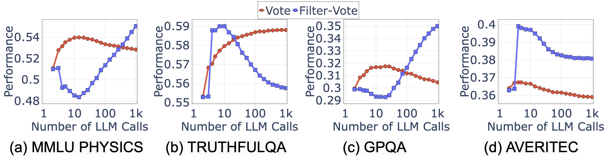

# 🎓 Are More LM Calls All You Need? Towards the Scaling Laws of Compound AI Systems


Many recent state-of-the-art results in language tasks were achieved using compound systems that perform multiple Language Model (LM) calls and aggregate their responses. However, there is little understanding of how the number of LM calls affects such a compound system's performance. 

Here we initiate the study of scaling properties of compound inference systems, with a focus on Vote and Filter-Vote, two of the simplest compound system designs, which aggregate LM responses via majority voting, optionally applying LM filters.


## 🔍 Main Findings

<p align="center">
  
</p>
<p align="left">
  <b>Figure 1:</b> Performance of Vote and Filter-Vote (with GPT-3.5 as the LLM) on several diverse
tasks: MMLU PHYSICS, TRUTHFULQA, GPQA, and AVERITEC. Interestingly, the performance is not a monotonic function of number of LLM calls.
</p>


What are the main findings? In a nutshell, they are three-fold: (i) surprisingly, across multiple language tasks, the performance of both Vote and Filter-Vote can first increase but then decrease as a function of the number of LM calls, (ii) the diversity of query difficulty explains this phenomenon, and (iii) we can predict the optimal number of LM calls accurately.

## 🕹️ Obtaining Generations of Compound LM Systems

To generate the response by the compound AI systems we study, you can simply run the Jupyter notebooks offered in the root directory, such as [](https://github.com/lchen001/CompoundAIScalingLaws/blob/main/evaluate_averitec.ipynb) for the AVERITEC dataset. You will need an OpenAI API key for this. 


## 🚀 Performance Analysis 
You can still reproduce our analysis without the API key. In fact, we have released the generation logs under the folder `results/`. To analyze the performance, there are two steps. First, unzip the results.zip file by 

```
unzip results.zip
```

Then, one can run the Jupyter notebooks under the folder `analysis`, e.g., [](https://github.com/lchen001/CompoundAIScalingLaws/blob/main/analysis/ScaleModelAnalysis_AVERITEC.ipynb) for the AVERITEC dataset.

## 📣 Updates & Changelog

### 🔹 2024.10.31 - Initial Release
  - ✅ The project is now live!


## 🎯 Reference


If you use our findings and/or datasets in a research paper, please cite our work as follows:


```
@article{chen2024scalinglaws,
  title={{Are More LM Calls All You Need? Towards Scaling Laws of Compound AI Systems}},
  author={Chen, Lingjiao and Davis, Jared and Hanin, Boris and Bailis, Peter and Stoica, Ion and Zaharia, Matei and Zou, James},
  conference={NeurIPS 2024},
  year={2024}
}
```